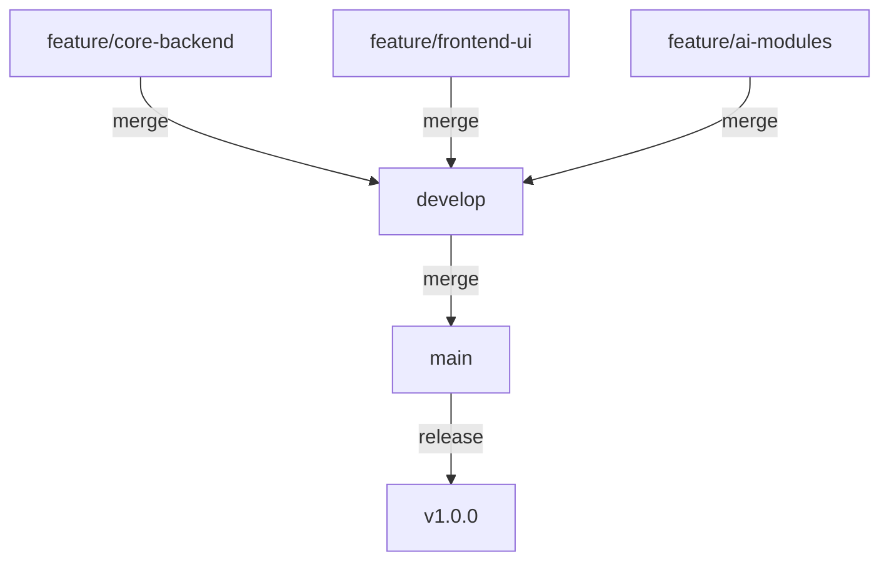

# Smart HR Analytics Platform v2.0 🚀

> **AI-Powered Enterprise Solutions for Human Resource Management**

A comprehensive, microservices-oriented HR platform integrating cutting-edge AI for performance tracking, interview automation, and employee retention analytics.

---

## 🏗️ Repository Architecture

This repository follows a professional **Git Flow** branching strategy to ensure a clean, reliable, and visual commit history.



### 📁 Project Structure

```text
├── 🧠 Cv_Screen/                 # AI-powered CV matching & screening
├── 🎤 Dynamic_Interview/          # Real-time AI interview questions & analysis
├── 📊 Employee_Retention/         # Workforce stability & churn prediction
├── 📈 Performance_Productivity/   # Employee efficiency & KPI tracking
├── 🖥️ frontend/                   # React.js Analytics Dashboard UI
├── ⚙️ backend/                    # Core Node.js/Express Microservices
├── 🐍 MasterAPI.py                # Python Flask Gateway for AI Modules
├── 📄 package.json                # Project dependencies
└── 🧪 Run.txt                     # Execution instructions
```

---

## ⚡ Key Features

- 💎 **Midnight Aurora UI**: Premium, glassmorphic dashboard design.
- 🤖 **AI Interviewer**: Dynamically generated technical questions based on candidate profiles.
- 📉 **Retention Analytics**: Machine learning models predicting employee turnover risk.
- 🏢 **Modular Microservices**: Scalable architecture for enterprise-grade deployments.

---

## 🛠️ Getting Started

### Prerequisites
- Node.js v16+
- Python 3.9+
- MongoDB instance

### Installation
1. **Clone the repository**
   ```bash
   git clone https://github.com/Shamilika15/HR-Management.git
   ```
2. **Setup Frontend**
   ```bash
   cd frontend
   npm install
   npm start
   ```
3. **Setup Backend**
   ```bash
   cd backend
   npm install
   npm start
   ```
4. **Setup AI Gateway**
   ```bash
   pip install -r requirements.txt
   python MasterAPI.py
   ```

---

## 🌳 Versioning & Git Flow

We use a structured branching model:
- `main`: Production-ready code.
- `develop`: Integration branch for features.
- `feature/*`: Dedicated branches for modular development.

---

© 2026 Smart HR Analytics Team. All rights reserved.
