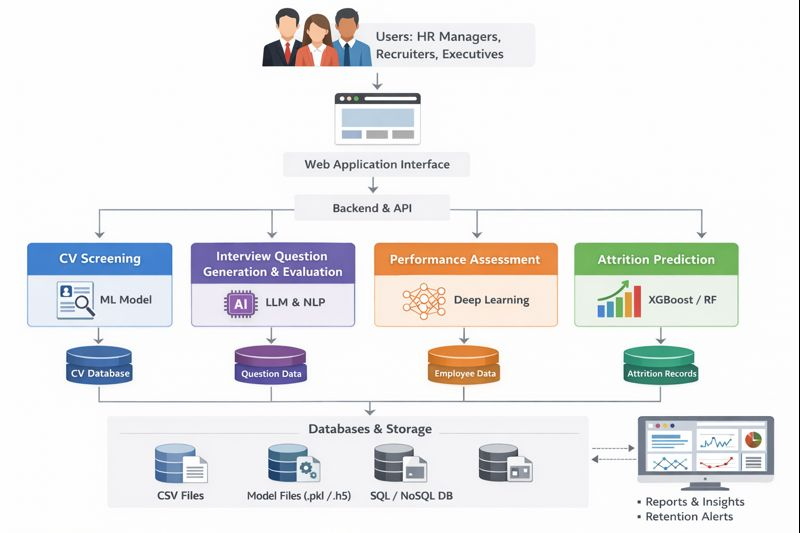

# AI-Driven Human Capital Management & Workforce Optimization System

## 📌 Project Overview
Modern organizations face increasing challenges in managing the complete employee lifecycle, including large-scale recruitment, inconsistent interview evaluations, biased performance assessments, and high employee attrition rates. Traditional HR processes are often manual, subjective, and reactive, leading to poor hiring decisions, reduced productivity, and increased turnover costs.

This project proposes an **AI-Driven Human Capital Management (HCM) and Workforce Optimization System** as a **web-based administrative platform** that integrates multiple intelligent HR modules. The system provides **data-driven, fair, and explainable decision support** for HR managers, recruiters, and organizational leaders, covering the full employee lifecycle from recruitment to retention.

---

## 🎯 Key Objectives
- Automate and optimize CV screening and candidate shortlisting using AI.
- Generate role-specific interview questions and automate candidate evaluation.
- Monitor employee performance and productivity using machine learning.
- Predict employee feedback/performance levels with confidence scores.
- Identify attrition risks early and support proactive retention strategies.
- Provide a unified HR dashboard with analytics, alerts, and reports.

---

## 🧩 System Modules
| Module | Description |
|------|-------------|
| **Smart CV Screening & Candidate Profiling** | Uses NLP and ML to analyze CVs, extract skills, and rank candidates based on job fit. |
| **Dynamic Interview Question Generation & Automated Evaluation** | Generates role-specific interview questions and evaluates responses using AI-based scoring rubrics. |
| **Performance & Productivity Monitoring** | Predicts employee feedback/performance levels and tracks productivity trends over time. |
| **Predictive Employee Retention & Attrition Analytics** | Identifies employees at risk of leaving and supports early HR intervention with explainable insights. |

---

## 👥 Target Users / Beneficiaries
- **HR Managers** – Data-driven hiring, performance evaluation, and retention planning.
- **Recruiters** – Faster candidate screening, interviews, and shortlisting.
- **Organizational Leaders** – Workforce analytics for strategic planning.
- **Employees** – Fair evaluations, timely feedback, and improved engagement.

---

## 🏗️ System Architecture
The system is designed as a **modular web-based admin platform** with integrated AI/ML pipelines for each HR function.

### ✅ Architecture Diagram
 

---

## 🔄 High-Level Workflow
1. HR Admin logs into the system dashboard.
2. Recruitment module processes CVs and generates candidate rankings.
3. Shortlisted candidates are moved to the interview module.
4. AI generates interview questions and evaluates candidate responses.
5. Hired employees are added to the employee management module.
6. Performance and productivity data is monitored continuously.
7. AI predicts feedback levels and detects performance risks.
8. Attrition risk is predicted with explainable drivers.
9. HR assigns retention actions and tracks intervention outcomes.

---

## 🧠 Technologies & Tools Used

### ✅ Frontend
- React.js
- Material UI (MUI)
- React Router
- Recharts / Chart.js
- HTML, CSS, JavaScript

### ✅ Backend *(optional / future integration)*
- Node.js + Express OR Flask / Django
- REST API architecture

### ✅ Machine Learning / AI
- Python
- TensorFlow / Keras
- Scikit-learn
- Pandas, NumPy
- Deep Neural Networks
- NLP (BERT / Transformers – concept level)
- Model evaluation metrics:
  - Accuracy, Precision, Recall, F1-score
  - Confusion Matrix
  - ROC-AUC (multi-class)

### ✅ Database *(optional / simulated in UI)*
- MySQL / PostgreSQL / MongoDB
- Firebase (optional)

---

## 🖥️ Admin Dashboard Features
- Recruitment overview and hiring funnel
- Interview evaluation reports
- Employee performance analytics
- Feedback prediction dashboard
- Attrition risk alerts and early warnings
- Bias & fairness monitoring
- Audit logs and HR reports

---

## 🔐 Ethical AI & Fairness
- Bias mitigation through anonymization during screening and interviews
- Explainable AI outputs for trust and transparency
- Role-based KPI evaluation
- Secure handling of employee data (conceptual)

---

## 📊 Sample Outputs
- Candidate ranking score
- Interview evaluation score and recommendation
- Attrition risk category (Low / Medium / High)
- Retention action recommendations

